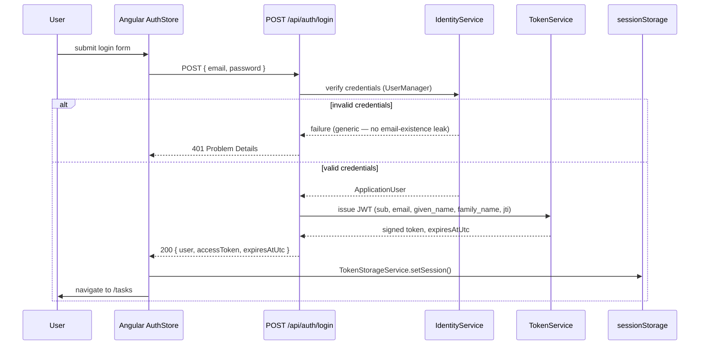
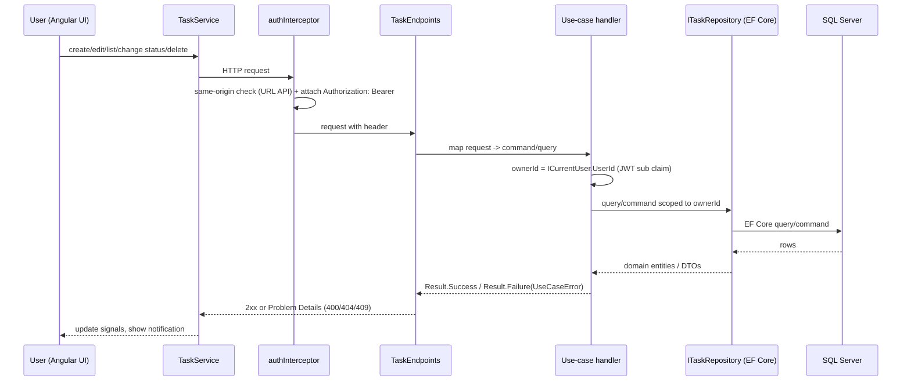
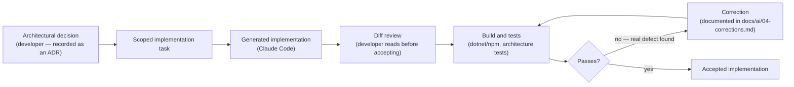

# Additional diagrams

Supplementary Mermaid diagrams that go beyond what's already in
[`solution-overview.md`](solution-overview.md) (which has its own system-context, container, and
error-handling diagrams — not repeated here to avoid duplication).

## Authentication sequence

## Task request sequence

## AI-assisted engineering workflow

This loop — not a single generate-and-ship step — is why `docs/ai/03-review-findings.md` and
`docs/ai/04-corrections.md` contain real entries rather than being empty. See
[`docs/ai/01-development-workflow.md`](../ai/01-development-workflow.md) for the full description of
how architectural analysis and implementation were divided between tools.
