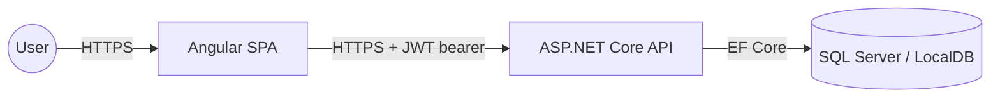
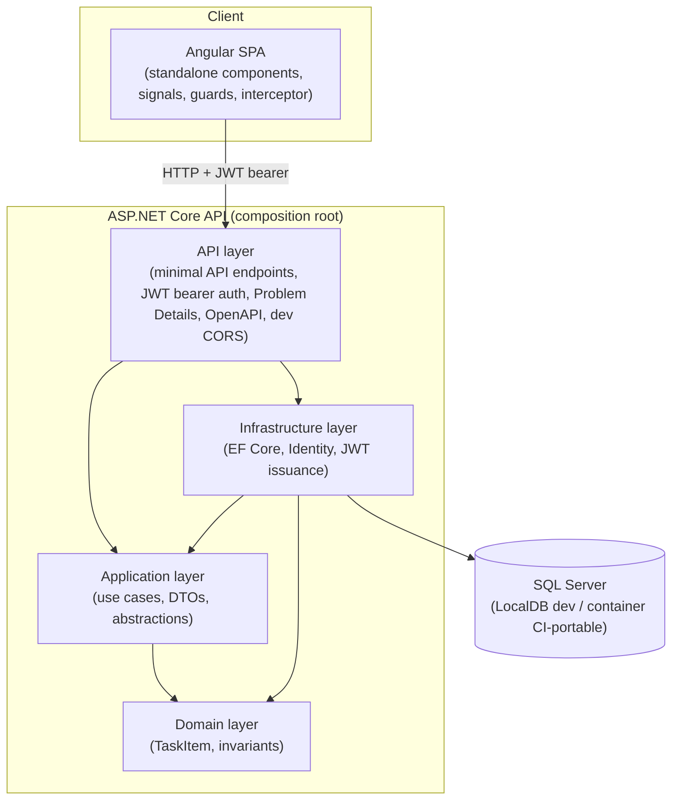
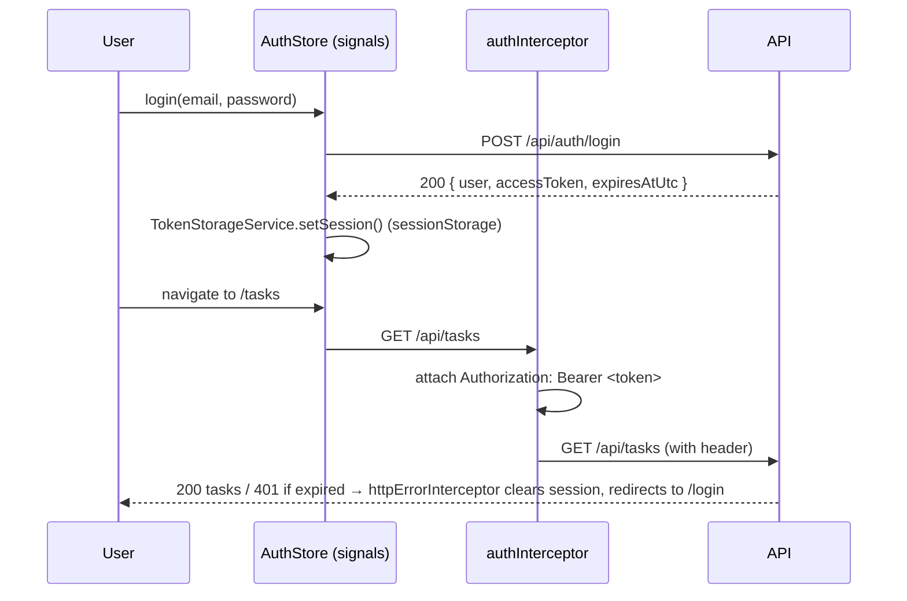
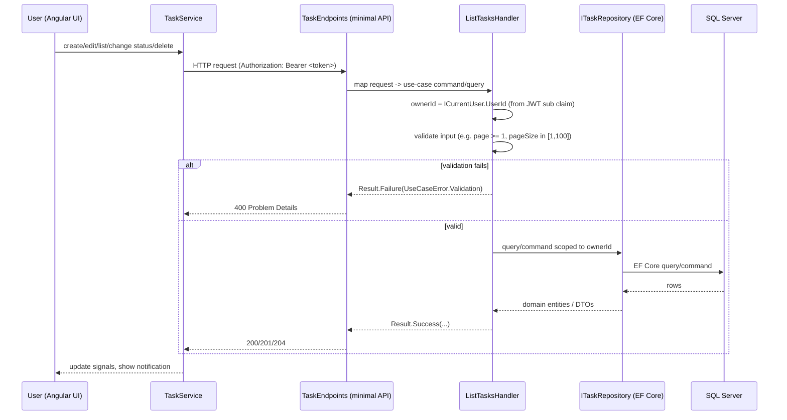
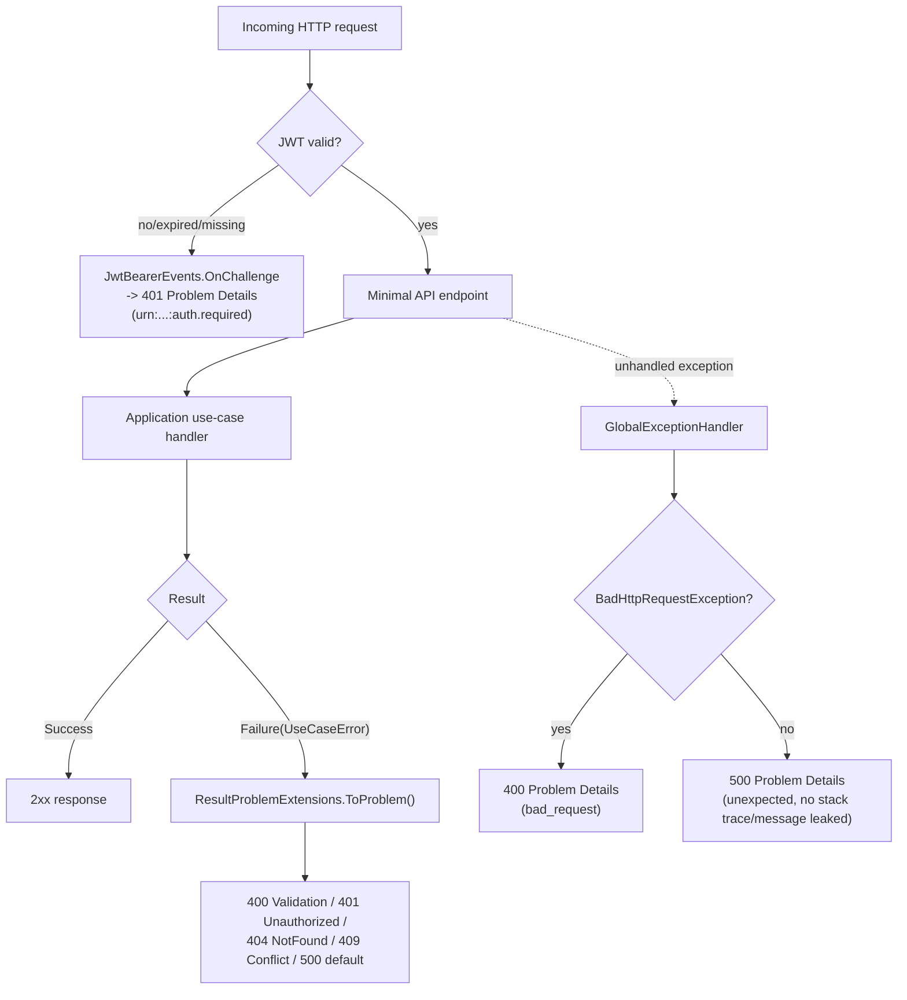

# Solution Overview

## System purpose

A personal task-management application where registered users manage their own tasks.

## Informal user story

```text
As a registered user,
I want to create, view, update, complete, and delete my personal tasks,
so that I can organize my work and track upcoming deadlines.
```

## Context diagram



The backend (API, Domain, Application, Infrastructure, SQL Server persistence, ASP.NET Core Identity,
JWT authentication, task CRUD) and the Angular SPA (authentication, route guards, task CRUD UI, wired
to the real backend) are both fully implemented — see
[ADR-004](../decisions/ADR-004-angular-spa.md) and [ADR-011](../decisions/ADR-011-spa-token-storage.md).

## Container / component diagram



### Angular authentication flow



Route guards (`authGuard`/`guestGuard`) wait on `AuthStore.initialize()` (which restores the session
from `sessionStorage` and re-validates it against `GET /api/auth/me`) before allowing or redirecting —
never on the mere presence of a token string. Guards are a UX convenience only; the API independently
authorizes every request against the JWT's `sub` claim regardless of what the SPA renders.

### Task request flow



### Error-handling flow



Every path a client-visible response can take ends in an RFC 7807 Problem Details body — including
authentication failures (`JwtBearerEvents.OnChallenge`), application-layer failures
(`UseCaseError.ToProblem()`), transport-level failures (`GlobalExceptionHandler`'s
`BadHttpRequestException` case), and truly unexpected exceptions (the same handler's catch-all) — so
the frontend's `ApiErrorService` only ever has to parse one response shape regardless of which layer
produced the error.

## Dependency direction

```text
Domain <- Application <- Infrastructure
                 ^
                API
```

* **API is the composition root.** It wires up dependency injection, configures JWT bearer
  authentication middleware, and is the only project allowed to depend on both `Application` and
  `Infrastructure` directly.
* **Infrastructure implements Application's abstractions.** `Application` defines ports
  (`ITaskRepository`, `IIdentityService`, `ITokenService`, `ICurrentUser`, `IClock`) for persistence,
  identity, and other external concerns; `Infrastructure` (and, for `ICurrentUser`, the API project —
  see [ADR-003](../decisions/ADR-003-identity-jwt.md)) provide the concrete implementations.
  `Application` never references `Infrastructure`.
* **Domain has no outward dependencies.** `TaskItem` does not reference `Application`,
  `Infrastructure`, `Api`, ASP.NET Core, Entity Framework Core, or ASP.NET Core Identity.
* **Infrastructure has no dependency on the ASP.NET Core web framework at all** — it is a plain,
  portable class library (see [ADR-003](../decisions/ADR-003-identity-jwt.md) for why `SignInManager`
  and `IHttpContextAccessor` are deliberately not used there).

These rules are enforced by automated architecture tests (`tests/Ballastlane.Tasks.ArchitectureTests`,
11 tests including `Infrastructure_ShouldNotDependOn_Api`) and fail the build if violated — verified
twice by temporarily introducing a forbidden reference and confirming the corresponding test fails.

## Principles

* **Dependency inversion** — inner layers (Domain, Application) define abstractions; outer layers
  (Infrastructure, API) depend on and implement them, never the reverse.
* **Separation of concerns** — each layer has a single, well-defined responsibility.
* **Framework isolation** — Domain and Application are free of ASP.NET Core, EF Core, and Identity
  types, so business rules can be tested and reasoned about independently of the delivery mechanism.
* **Thin controllers** — API endpoints (minimal API handlers) translate HTTP requests into Application
  use cases and map `Result`/`Result<T>` outcomes to HTTP responses; they contain no business logic.
* **Server-controlled ownership** — every task read/write is scoped by `ICurrentUser.UserId`, taken
  from the validated JWT, never from the request body or route; a task belonging to another user
  returns `404`, not `403` (see [ADR-008](../decisions/ADR-008-cross-user-404.md)).
* **Explicit use cases** — Application exposes intention-revealing operations (`CreateTaskHandler`,
  `ChangeTaskStatusHandler`, etc.) rather than a generic CRUD repository.
* **Behavioral testing** — tests describe expected behavior (domain rules, use case outcomes, HTTP
  contracts) rather than implementation details or mock call counts.
* **No premature distributed architecture** — this is a modular monolith; the problem does not justify
  microservices, message queues, or event sourcing at this scale. See
  [ADR-001](../decisions/ADR-001-clean-architecture-modular-monolith.md).

## Frontend architecture notes

* **Task feature boundaries.** `features/tasks/` owns everything task-related (models, `TaskService`,
  list/form/create/edit pages, the status badge); `features/auth/` and `features/profile/` are
  separate, so no cross-feature coupling exists beyond the shared `core/`/`shared/` layers.
* **Problem Details handling.** `ApiErrorService` (`core/http/api-error.service.ts`) normalizes every
  `HttpErrorResponse` into a typed `ApiError`, matching the backend's real Problem Details shape —
  `errors` is a flat `string[]` (confirmed against a running instance), not the
  `Record<string, string[]>` shape ASP.NET Core MVC's default validation problem details would
  produce. Components read `.message`/`.details` for display; they never render raw response bodies.
* **`DateOnly` handling.** The backend's `DueDate` is a .NET `DateOnly?`, serialized as a plain
  `"yyyy-MM-dd"` string with no time/timezone component (see
  [ADR-006](../decisions/ADR-006-taskitem-domain-model.md)). The frontend (`shared/utilities/date-only.ts`)
  never constructs a `Date` object from it — comparison uses plain ISO-string lexicographic ordering,
  and display uses manual string parsing — specifically to avoid the classic bug where
  `new Date('2026-07-26')` (parsed as UTC midnight) displays as the previous day in a timezone behind
  UTC. `<input type="date">` binds the same `"yyyy-MM-dd"` string directly, with no conversion either.
* **Session-storage trade-off.** See [ADR-011](../decisions/ADR-011-spa-token-storage.md) for the full
  discussion of why `sessionStorage`, what it doesn't protect against, and the `HttpOnly` cookie
  alternative for production.

## Current versus planned status

| Component                                   | Status                                            |
|----------------------------------------------|----------------------------------------------------|
| Solution structure & dependency rules         | Implemented                                        |
| Architecture tests                            | Implemented                                        |
| `GET /health` endpoint                        | Implemented                                        |
| `TaskItem` domain model                       | Implemented                                        |
| Task CRUD use cases                           | Implemented                                        |
| EF Core + SQL Server persistence              | Implemented                                        |
| SQL Server LocalDB setup                      | Implemented                                        |
| SQL Server container (Docker) setup           | Planned — Docker unavailable in this development environment |
| ASP.NET Core Identity                         | Implemented                                        |
| JWT bearer authentication                     | Implemented                                        |
| Authorization (per-request, ownership-scoped) | Implemented                                        |
| Demo data seeding (Development only)          | Implemented                                        |
| OpenAPI with bearer auth (Swagger)            | Implemented                                        |
| Angular workspace shell                       | Implemented                                         |
| Angular authentication UI                     | Implemented                                         |
| Angular task management UI                    | Implemented                                         |
| Angular route guards + JWT interceptor        | Implemented                                         |
| Development CORS (Angular dev origin)         | Implemented                                         |
| JWT client-side storage strategy              | Implemented — see [ADR-011](../decisions/ADR-011-spa-token-storage.md) |
| Pagination input validation (400 on invalid page/pageSize) | Implemented              |
| Consistent Problem Details for auth (401) failures | Implemented                        |
| CI: unit/architecture tests (Linux) + LocalDB integration tests (Windows), format + vulnerability checks | Implemented |
| Refresh tokens                                | Not planned for this exercise                       |
| Real browser (E2E) test automation            | Not available — no `chromium-cli`/Playwright in this environment; see root README §20 |
| Docker Compose / Testcontainers               | Planned — Docker unavailable in this development environment |
